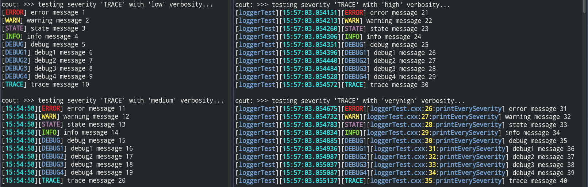

# FairLogger

Lightweight and fast C++ Logging Library



| Branch | Build Status |
| :---: | :--- |
| `master` |  |
| `dev` |  |

## Installation

```bash
git clone https://github.com/FairRootGroup/FairLogger
mkdir FairLogger_build && cd FairLogger_build
cmake -DCMAKE_INSTALL_PREFIX=./FairLogger_install ../FairLogger
cmake --build . --target install
```

FairLogger bundles a version of the [fmt](https://github.com/fmtlib/fmt) library. You can override this with your own fmt installation via the `-DUSE_EXTERNAL_FMT=ON` and `-DFMT_ROOT=/fmt/location` CMake switches.

## Usage

In your `CMakeLists.txt`:

```cmake
find_package(FairLogger)
```

If FairLogger is not installed in system directories, you can hint the installation location:

```cmake
set(CMAKE_PREFIX_PATH /path/to/FairLogger/installation ${CMAKE_PREFIX_PATH})
find_package(FairLogger)
```

`find_package(FairLogger)` will define an imported target `FairLogger::FairLogger`.

If FairLogger is built with `-DUSE_BOOST_PRETTY_FUNCTION=ON` and/or `-DUSE_EXTERNAL_FMT=ON`, your project needs to find the external dependencies, too, e.g.

```cmake
find_package(FairLogger)
foreach(dep IN LISTS FairLogger_PACKAGE_DEPENDENCIES)
  find_package(${dep} ${FairLogger_${dep}_VERSION})
endforeach()
```

## CMake options

On command line:

  * `-DDISABLE_COLOR=ON` disables coloured console output.
  * `-DBUILD_TESTING=OFF` disables building of unit tests.
  * `-DUSE_BOOST_PRETTY_FUNCTION=ON` enables usage of `BOOST_PRETTY_FUNCTION` macro.
  * `-DUSE_EXTERNAL_FMT=ON` uses external fmt instead of the bundled one.

## Documentation

## 1. General

All log calls go through the provided LOG(severity) macro. Output through this macro is thread-safe. Logging is done to cout, file output and/or custom sinks.

## 2. Additional macros

A number of additional logging macros are provided:

- `LOGV(severity, verbosity)` Log the line with the provided verbosity, e.g. `LOG(info, veryhigh) << "abcd";`
- `LOGF(severity, ...)` The arguments are given to `fmt::printf`, which formats the string using a [printf syntax](https://fmt.dev/dev/api.html#printf-formatting) and the result is logged, e.g. `LOGF(info, "Hello %s!", "world");`
- `LOGP(severity, ...)` The arguments are given to `fmt::format`, which formats the string using a [Python-like syntax](https://fmt.dev/dev/syntax.html) and the result is logged, e.g. `LOGP(info, "Hello {}!", "world");`
- `LOGN(severity)` Logs an empty line, e.g. `LOGN(info);`
- `LOG_IF(severity, condition)` Logs the line if the provided condition if true
- `LOGD(severity, file, line, f)` Logs the line with the provided file, line and function parameters (only if the active verbosity allows it).

## 3. Severity

The log severity is controlled via:
```C++
fair::Logger::SetConsoleSeverity("<severity level>");
// and/or
fair::Logger::SetFileSeverity("<severity level>");
// and/or
fair::Logger::SetCustomSeverity("<customSinkName>", "<severity level>");
```

where severity level is one of the following:

```C++
"nolog",
"trace",
"debug4",
"debug3",
"debug2",
"debug1",
"debug",
"info",
"state",
"warn",
"error",
"fatal",
```

Logger will log the chosen severity and all above it (except "nolog", which deactivates logging for that sink completely). Fatal severity is always logged.

## 3.1 Compile-time severity switch

The minimum severity level can be configured at compile time via definition of `FAIR_MIN_SEVERITY`:

```
cmake -DFAIR_MIN_SEVERITY=warn ..
```
The above would only log severities equal to or above `warn`.

When `FAIR_MIN_SEVERITY` is not provided all severities are enabled.

## 4. Verbosity

The log verbosity is controlled via:
```C++
fair::Logger::SetVerbosity("<verbosity level>");
```

it is same for all sinks, and is one of the following values: `verylow`, `low`, `medium`, `high`, `veryhigh`, `user1`, `user2`, `user3`, `user4`, which translates to following output:

```
verylow:  message
low:      [severity] message
medium:   [HH:MM:SS][severity] message
high:     [process_name][HH:MM:SS][severity] message
veryhigh: [process_name][HH:MM:SS:µS][severity][file:line:function] message
user1:    [severity] message
user2:    [severity] message
user3:    [severity] message
user4:    [severity] message
```

When running a FairMQ device, the log severity can be simply provided via `--verbosity <level>` cmd option.

The user may customize the existing verbosities or any of `user1`, `user2`, `user3`, `user4` verbosities via:
```C++
void fair::Logger::DefineVerbosity(fair::Verbosity, fair::VerbositySpec);
void fair::Logger::DefineVerbosity("<verbosity level>", fair::VerbositySpec);
```

The `fair::Logger::VerbositySpec` object can e.g. be created like this:
```C++
auto spec = fair::VerbositySpec::Make(VerbositySpec::Info::timestamp_s,
                                      VerbositySpec::Info::process_name);
// results in [HH:MM:SS][process_name] message
```

| **Argument** | **Result** |
| --- | --- |
| `fair::VerbositySpec::Info::process_name`       | `[process_name]`       |
| `fair::VerbositySpec::Info::timestamp_s`        | `[HH:MM:SS]`           |
| `fair::VerbositySpec::Info::timestamp_us`       | `[HH:MM:SS:µS]`        |
| `fair::VerbositySpec::Info::severity`           | `[severity]`           |
| `fair::VerbositySpec::Info::file`               | `[file]`               |
| `fair::VerbositySpec::Info::file_line`          | `[file:line]`          |
| `fair::VerbositySpec::Info::file_line_function` | `[file:line:function]` |


### 4.1 `BOOST_PRETTY_FUNCTION` support

By default, the `veryhigh` verbosity prints the function name from which the `LOG` macro was invoked. If you desire a more verbose function signature including the full namespace, return value and function arguments, you can enable support for `BOOST_PRETTY_FUNCTION`

* **globally** by compiling FairLogger with the CMake option `-DUSE_BOOST_PRETTY_FUNCTION=ON`, or
* **per translation unit** by defining `FAIRLOGGER_USE_BOOST_PRETTY_FUNCTION` before including the FairLogger header, e.g.

```C++
#define FAIRLOGGER_USE_BOOST_PRETTY_FUNCTION
#include <Logger.h>
```

In the latter case, the user needs to take care of adding the boost include path to the compiler search path manually (e.g. `-I/path/to/boost/include`).

## 5. Color

Colored output on console can be activated with:
```C++
Logger::SetConsoleColor(true);
```

When running a FairMQ device, the log color (console) can be simply provided via `--color <true/false>` cmd option (default is true).

## 6. File output

Output to file can be enabled via:
```C++
Logger::InitFileSink("<severity level>", "test_log", true);
```
which will add output to "test_log" filename (if third parameter is `true` it will add timestamp to the file name) with `<severity level>` severity.

When running a FairMQ device, the log file can be simply provided via `--log-to-file <filename_prefix>` cmd option (this will also turn off console output).

## 7. Custom sinks

Custom sinks can be added via `Logger::AddCustomSink("sink name", "<severity>", callback)` method.

Here is an example adding a custom sink for all severities ("trace" and above). It has access to the log content and meta data. Custom log calls are also thread-safe.

```C++
    Logger::AddCustomSink("MyCustomSink", "trace", [](const string& content, const LogMetaData& metadata)
    {
        cout << "content: " << content << endl;

        cout << "available metadata: " << endl;
        cout << "std::time_t timestamp: " << metadata.timestamp << endl;
        cout << "std::chrono::microseconds us: " << metadata.us.count() << endl;
        cout << "std::string process_name: " << metadata.process_name << endl;
        cout << "std::string file: " << metadata.file << endl;
        cout << "std::string line: " << metadata.line << endl;
        cout << "std::string func: " << metadata.func << endl;
        cout << "std::string severity_name: " << metadata.severity_name << endl;
        cout << "fair::Severity severity: " << static_cast<int>(metadata.severity) << endl;
    });
```

If only output from custom sinks is desirable, console/file sinks must be deactivated by setting their severity to `"nolog"`.

## Naming conflicts?

By default, `<fairlogger/Logger.h>` defines unprefixed macros: `LOG`, `LOGV`, `LOGF`, `LOGP`, `LOGN`, `LOGD`, `LOG_IF`.

Define an option `FAIR_NO_LOG*` to prevent the above unprefixed macros to be defined, e.g.

```C++
#define FAIR_NO_LOG
#define FAIR_NO_LOGF
#include <fairlogger/Logger.h>
```

## License

GNU Lesser General Public Licence (LGPL) version 3, see [LICENSE](LICENSE).

Copyright (C) 2017-2020 GSI Helmholtzzentrum fuer Schwerionenforschung GmbH
